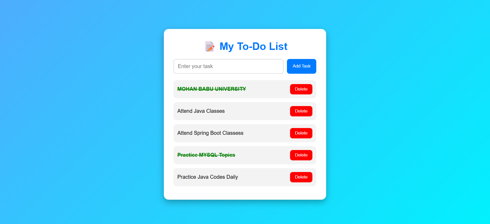
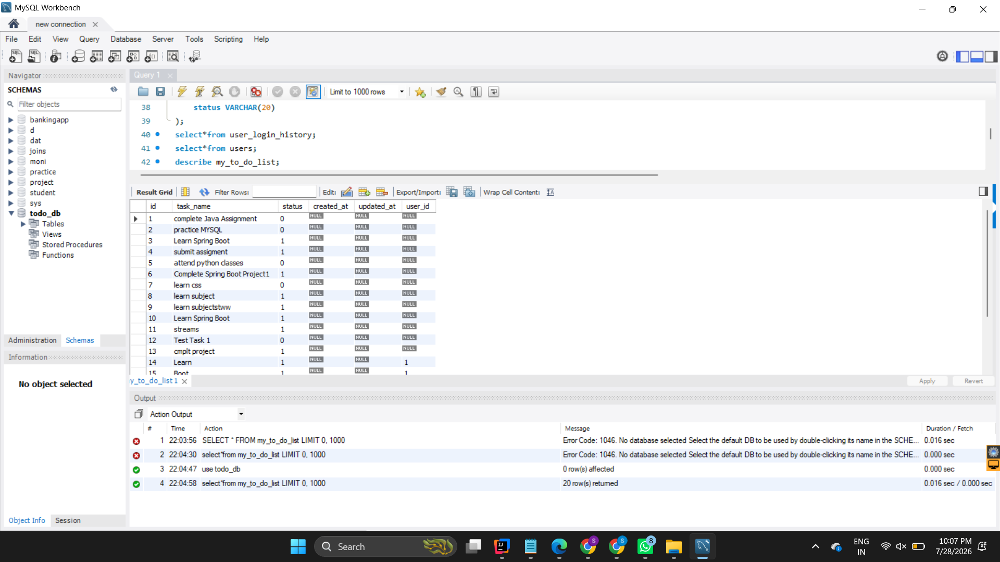

# 📝 My To-Do List Application

A full-stack **To-Do List Management System** developed using **Spring Boot, MySQL, HTML, CSS, and JavaScript**. This application allows users to register, log in, manage their daily tasks, and maintain task history and login history.

---

## 🚀 Features

### 👤 User Module
- User Registration
- User Login
- User Logout
- Login History Tracking

### ✅ Task Module
- Create Task
- View Tasks
- Update Task
- Delete Task (Soft Delete)
- User-wise Task Management

### 📜 History Module
- Task Creation History
- Task Update History
- Task Delete History
- Login & Logout History

---

## 🛠️ Technologies Used

### Frontend
- HTML5
- CSS3
- JavaScript

### Backend
- Java
- Spring Boot
- Spring Data JPA
- REST API

### Database
- MySQL

### Tools
- IntelliJ IDEA
- Postman
- MySQL Workbench
- Git
- GitHub

---

## 📂 Project Structure

```
My-To-Do-List
│
├── Frontend
│   ├── index.html
│   ├── style.css
│   └── script.js
│
├── Backend
│   ├── src
│   ├── pom.xml
│   ├── mvnw
│   └── .mvn
│
├── Output
│
├── Database
│   └── todo_db.sql
│
└── README.md
```

---

## 📊 Database Tables

- users
- my_to_do_list
- todo_history
- user_login_history

---

## 🔗 REST API Endpoints

### Register

```
POST /users/register
```

### Login

```
POST /users/login
```

### Logout

```
POST /users/logout/{userId}
```

### Create Task

```
POST /todos
```

### Get All Tasks

```
GET /todos
```

### Get User Tasks

```
GET /todos/user/{userId}
```

### Update Task

```
PUT /todos/{id}
```

### Delete Task

```
DELETE /todos/{id}
```

---

# 📸 Project Screenshots

## 🏠 Home Page


---

## 👤 User Registration


---

## 🔐 User Login


---

## ➕ Create Task


---

## ✏️ Update Task


---

## ❌ Delete Task


---

## 🗄️ Database


---

## 📬 API Testing (Postman)


---

# ▶️ How to Run

### Clone Repository

```bash
git clone https://github.com/sareddypraveena/My-To-Do-List.git
```

### Open Backend

Open the project in **IntelliJ IDEA**.

### Configure Database

Update the MySQL username and password in:

```
application.properties
```

### Run

Run the Spring Boot application.

Open:

```
http://localhost:8080
```

---

# 👩‍💻 Developed By

**Praveena Sareddy**

- Java Developer
- Spring Boot Developer
- Full Stack Java Learner

---
## Output



#


⭐ If you like this project, don't forget to Star this repository.
